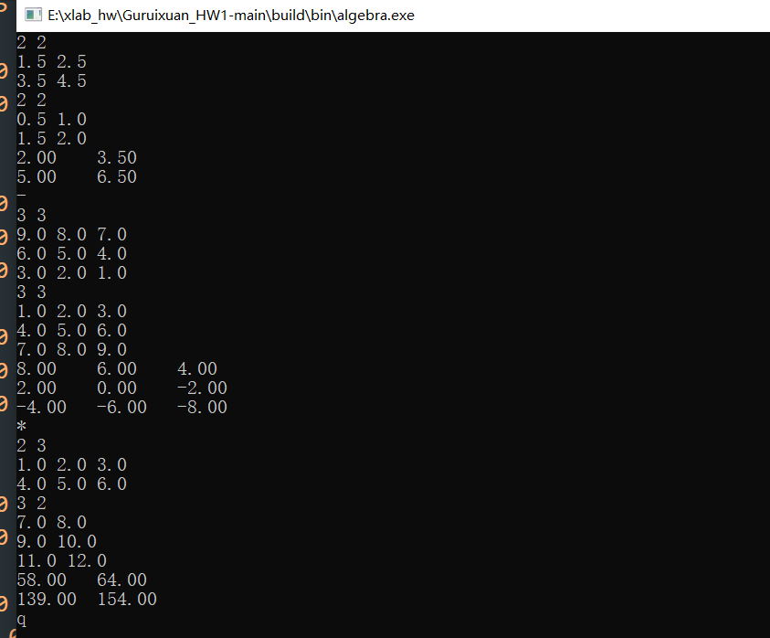
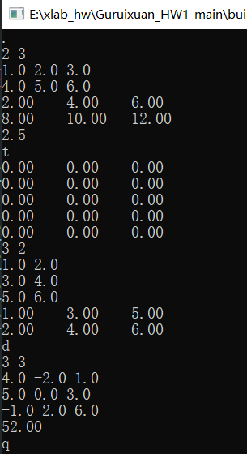
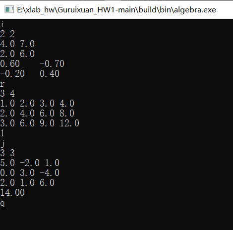
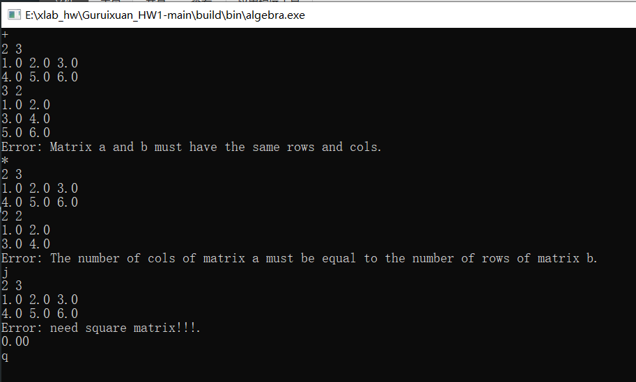
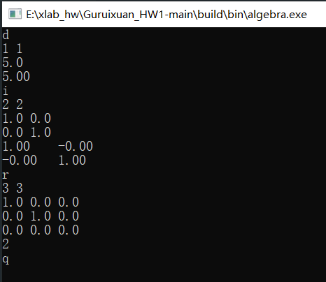

# Guruixuan_HW1
## 程序思路
### 1. 矩阵加法 add_matrix
**思路**：首先检查两个矩阵维度是否相同，不同则返回错误；然后遍历每个元素，对应位置相加。
**核心算法**：
```c
result[i][j] = a[i][j] + b[i][j]
```
### 2. 矩阵减法 sub_matrix
**思路**：与加法类似，检查维度后对应元素相减。
**核心算法**：
```c
result[i][j] = a[i][j] - b[i][j]
```
### 3. 矩阵乘法 mul_matrix
**思路**：检查a的列数是否等于b的行数，然后使用三层循环计算。
**核心算法**：
```c
for i, j, k:
  result[i][j] += a[i][k] * b[k][j]
```
### 4. 矩阵数乘 scale_matrix
**思路**：遍历矩阵每个元素，将其乘以标量k。
**核心算法**：
```c
result[i][j] = a[i][j] * k
```
### 5. 矩阵转置 transpose_matrix
**思路**：创建新矩阵，交换行列索引。
**核心算法**：
```c
result[j][i] = a[i][j]
```
### 6. 矩阵的迹 trace_matrix
**思路**：检查是否为方阵，然后计算对角线元素和。
**核心算法**：
```c
trace = Σa[i][i] (i从0到n-1)
```
高级矩阵操作
### 7. 矩阵行列式 det_matrix
**思路**：使用递归实现，按第一行展开计算。
基本情况：1×1矩阵直接返回元素值
递归情况：计算每个元素与其代数余子式的乘积之和
**核心算法**：
```c
if n=1: return a[0][0]
det = 0
for j = 0 to n-1:
  子矩阵 = 移除第一行和第j列后的矩阵
  det += (-1)^j * a[0][j] * det_matrix(子矩阵)
```
### 8. 矩阵求逆 inv_matrix
**思路**：使用伴随矩阵方法
- 检查是否为方阵，计算行列式
- 计算每个元素的代数余子式
- 组成伴随矩阵并除以行列式

**核心算法**：$inv =\frac {adj}{det}$,  其中adj[j][i]是a[i][j]的代数余子式
### 9. 矩阵的秩 rank_matrix
 **思路**：使用高斯消元法
- 创建矩阵副本
- 按列消元，寻找主元
- 用主元消去同列其他元素
- 秩等于非零行数
  
**核心算法**：高斯消元法实现，通过行变换将矩阵转换为阶梯形式，计算主元个数

## 测试数据
**Sample Input 1:（基础矩阵运算）**
```bash
+
2 2
1.5 2.5
3.5 4.5
2 2
0.5 1.0
1.5 2.0
-
3 3
9.0 8.0 7.0
6.0 5.0 4.0
3.0 2.0 1.0
3 3
1.0 2.0 3.0
4.0 5.0 6.0
7.0 8.0 9.0
*
2 3
1.0 2.0 3.0
4.0 5.0 6.0
3 2
7.0 8.0
9.0 10.0
11.0 12.0
q
```
**Sample Output 1:**
```bash
2.00    3.50    
5.00    6.50    

8.00    6.00    4.00    
2.00    0.00    -2.00   
-4.00   -6.00   -8.00   

58.00   64.00   
139.00  154.00  
```
**Sample Input 2:（高级矩阵运算）**
```bash
.
2 3
1.0 2.0 3.0
4.0 5.0 6.0
2.5
t
3 2
1.0 2.0
3.0 4.0
5.0 6.0
d
3 3
4.0 -2.0 1.0
5.0 0.0 3.0
-1.0 2.0 6.0
q
```
**Sample Output 2:**
```bash
2.00    4.00    6.00    
8.00   10.00   12.00   

1.00    2.00        
3.00    4.00        
5.00    6.00

52.00
```

**Sample Input 3:（矩阵求逆和秩）**
```bash
i
2 2
4.0 7.0
2.0 6.0
r
3 4
1.0 2.0 3.0 4.0
2.0 4.0 6.0 8.0
3.0 6.0 9.0 12.0
j
3 3
5.0 -2.0 1.0
0.0 3.0 -4.0
2.0 1.0 6.0
q
```
**Sample Output 3:**
```bash
0.60    -0.70   
-0.20   0.40    

1

14.00
```
**Sample Input 4:（错误处理测试）**
```bash
+
2 3
1.0 2.0 3.0
4.0 5.0 6.0
3 2
1.0 2.0
3.0 4.0
5.0 6.0
*
2 3
1.0 2.0 3.0
4.0 5.0 6.0
2 2
1.0 2.0
3.0 4.0
j
2 3
1.0 2.0 3.0
4.0 5.0 6.0
q
```
**Sample Output 4:**
```bash
Error: Matrix a and b must have the same rows and cols.

Error: The number of cols of matrix a must be equal to the number of rows of matrix b.

Error: need square matrix!!!.
0
```
**Sample Input 5:（特殊矩阵测试）**
```bash
d
1 1
5.0
i
2 2
1.0 0.0
0.0 1.0
r
3 3
1.0 0.0 0.0
0.0 1.0 0.0
0.0 0.0 0.0
q
```
**Sample Output 5:**
```bash
5.00

1.00    0.00    
0.00    1.00    

2 
```
## 运行截图







